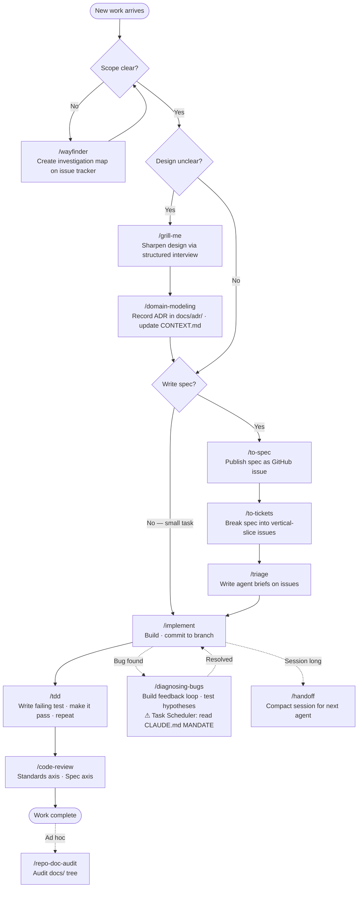

# Contributing

This guide explains how to contribute to Daily Motivation Brain Helper — through code, tests, or documentation.

## Project overview

- **One source file:** `DailyMotivation.ps1`
- **One binary:** `DailyMotivation.exe` (via `build.ps1` / ps2exe)
- **Domain language:** [CONTEXT.md](CONTEXT.md) — use these terms in code, commits, and docs
- **Agent notes:** [CLAUDE.md](CLAUDE.md) — architecture map and test-environment rules

## Prerequisites

| Requirement | Notes |
|-------------|--------|
| Windows 10 or 11 | Runtime target for the app |
| PowerShell 7 (`pwsh`) | Development and testing |
| Pester **5.x** | `Install-Module Pester -MinimumVersion 5.0 -Force -SkipPublisherCheck` |
| ps2exe (for builds) | `Install-Module ps2exe -Scope CurrentUser` |

The compiled exe targets **.NET Framework 4.x**, which is a limitation of ps2exe. For this reason, avoid PowerShell 7-only syntax in any code that runs at runtime: the null-coalescing operators (`??`, `?.`), `Join-String`, and `ForEach-Object -Parallel` are not available under .NET Framework 4.x.

## Getting started

```powershell
# Clone and enter the repo
cd Daily-Motivation-Brain-Helper

# Run tests (no exe required — tests use -NoRun)
.\Invoke-Tests.ps1

# Optional: build the exe
.\build.ps1
```

More detail: [docs/development/local-setup.md](docs/development/local-setup.md).

## Testing rules (critical)

1. **Windows 10/11 PowerShell 7 is the primary validation environment.**
2. Tests that pass only in a Linux sandbox are **not** sufficient validation for test suites that exercise Windows-specific features (Task Scheduler, the Windows registry, and CIM — the Windows hardware and OS information interface).
3. Platform-abstraction tests (`*.Platform.Tests.ps1`, `PlatformAdapter.Tests.ps1`, `FolderScheduling.Tests.ps1`) may run on Linux using `HeadlessPlatform`, a test-only stub that replaces Windows-specific APIs. See [CLAUDE.md](CLAUDE.md) for details.
4. Prefer `.\Invoke-Tests.ps1` over calling `Invoke-Pester` directly.
5. **An issue may not be closed if its resolution includes Windows-only tests (guarded by `-Skip:(-not $IsWindows)`) that have not been validated on a real Windows 10/11 machine.** Proof of validation — terminal output, a CI run link, or a screenshot — must be attached to the issue as a comment before closure. Linux CI passing is not sufficient. See the **GitHub Issue Closure Gate** MANDATE in [CLAUDE.md](CLAUDE.md) for the full rule and violation response procedure.

```powershell
.\Invoke-Tests.ps1                  # all tests + coverage (default)
.\Invoke-Tests.ps1 -CI              # exit code + NUnit XML
.\Invoke-Tests.ps1 -Tag Security    # filter by tag
.\Invoke-Tests.ps1 -Coverage $false # skip coverage
```

See [docs/testing/strategy.md](docs/testing/strategy.md).

## Code quality rules

- **No startup popups** in main mode — launch straight into the main window.
- Write comments that explain *why* code exists or behaves unexpectedly. Do not embed issue-tracker IDs directly in code (e.g., `# AG19-003:`); bug references belong in commit messages and GitHub issues, not inline comments.
- Use the domain terminology defined in [CONTEXT.md](CONTEXT.md) (for example: MotivationTask, Open Folder, Handoff, OS Task). Consistent terms help both human reviewers and the AI agent understand your changes.
- Keep the single-file architecture unless an ADR changes it.

## Pull requests

1. Branch from the project's active development branch. Check the repository's default branch or open issues to identify which branch is currently active.
2. Keep changes focused; update documentation when behavior or externally visible functionality changes.
3. Run relevant tests on **Windows** before requesting review.
4. Fill out the PR template checklist.
5. Do not commit secrets, local `handoff.md` content meant to stay private, or large generated binaries unless intentional.

## Documentation

| Audience | Location |
|----------|----------|
| End users | [manual/](manual/README.md) |
| Developers | [docs/](docs/README.md) |
| Security reports | [SECURITY.md](SECURITY.md) |

## AI-assisted development (Claude skills)

This project uses Claude Code as an AI development agent. [CLAUDE.md](CLAUDE.md) is the project memory file that Claude Code automatically reads at the start of every session — it contains architecture notes, mandates, and persistent project context. Separately, this project defines a set of **custom slash commands** (called skills) stored in `CLAUDE/skills/`. Each skill is a Markdown file; invoking `/skill-name` in a Claude Code session executes the instructions in that file. (In this workflow, "issue" and "ticket" both refer to GitHub Issues.)

The skills listed below are the ones actively used in day-to-day development. They define the exact workflow used in this repository: which commands to run, in what order, and what constraints apply.

You do not need to use these skills yourself, but understanding them tells you what to expect when reviewing AI-generated contributions and what standards an agent-generated PR must meet.

### Standard development workflow



### Skill reference

#### `/wayfinder`

Use when the scope (the set of changes needed) is too large or too unclear to begin implementation. Produces a map of investigation tickets on the GitHub issue tracker. Each ticket answers one open question; the mapping step is complete when the scope and approach are clear enough to begin implementation. The scope is often described broadly at first and narrowed down as the agent explores the codebase.

#### `/grill-me`

A structured interview to sharpen a plan or design before building. Run this when the design has unresolved questions that would be time-consuming or disruptive to answer after implementation has already started. Does not itself produce ADRs — use `/domain-modeling` to record the resulting decision.

#### `/to-spec`

Synthesizes the current conversation into a spec (Product Requirements Document) and publishes it as a GitHub issue labelled `ready-for-agent`. Does not interview — it writes from what is already known. Use before `/implement` when the work warrants a written spec.

#### `/to-tickets`

Breaks a spec or plan into small, end-to-end slices of work and publishes them as GitHub issues. Each ticket lists the other tickets it depends on (its blocking dependencies). Use after `/to-spec` when the work is large enough to need multiple tickets.

#### `/triage`

Writes a structured agent brief on a GitHub issue when it moves to `ready-for-agent`. The brief is the authoritative contract an agent works from. Briefs describe **what** the system should do, not how to implement it. File paths are intentionally left out of briefs, because they change as the codebase evolves and would quickly become outdated.

#### `/implement`

The primary "do work" skill. Implements the work described in a spec or ticket set. Internally drives `/tdd` (see below) and ends with `/code-review`. Commits work to the current branch. Run this when there is a clear spec or ticket to work from.

#### `/tdd`

Test-driven development — write a failing test first, then make it pass. Tests verify behavior through public interfaces, not implementation details. The boundaries at which tests are placed (called seams) must be agreed before writing any test. Anti-patterns to avoid: tests that depend on internal implementation details rather than behavior; assertions that can never fail (for example, asserting that a value equals itself); and writing large batches of tests before any implementation exists. This skill is called internally by `/implement` and can also be invoked directly.

#### `/code-review`

Reviews the changes made since a chosen point in git history (a commit, branch, or tag) across two dimensions:

- **Standards axis** — does the code follow this repo's coding standards and ADRs?
- **Spec axis** — does the code faithfully implement the originating issue or spec?

Both axes run as parallel sub-agents and results are aggregated. Called automatically at the end of `/implement`. Can also be invoked directly when reviewing a branch or PR.

#### `/diagnosing-bugs`

A structured diagnosis loop for hard bugs and performance regressions. Works in phases: build a tight feedback loop first (failing test, CLI invocation, throwaway harness), then form and test hypotheses.

**Project-specific constraint:** If the bug involves Task Scheduler, context-menu invocation, or `Register-ScheduledTask`, read the **MANDATE** section in [CLAUDE.md](CLAUDE.md) before proceeding. That section documents 13+ failed fix attempts across 6 development waves where fixes passed automated tests but the bug was still present on a real Windows machine. Do not declare a Task Scheduler bug resolved without a live Windows 10/11 test. Passing the automated test pipeline (CI) is required, but it is not enough on its own to confirm the fix is correct on Windows.

#### `/domain-modeling`

Maintains `CONTEXT.md` (the authoritative domain vocabulary) and creates ADRs in `docs/adr/` when architectural decisions are made. Use when introducing new domain concepts or when an architectural decision needs to be recorded. Domain terms from `CONTEXT.md` must be used consistently in code, commits, and documentation.

#### `/handoff`

Compacts the current conversation into a handoff document so a fresh agent can continue the work. Saved to the operating system's temporary folder (e.g., `%TEMP%` on Windows), not to the project workspace — this prevents accidental commits of session notes. Use when a session is getting long or needs to be transferred. The document references existing artifacts (specs, ADRs, issues, diffs) rather than duplicating them.

#### `/repo-doc-audit`

Ad-hoc documentation audit across the `docs/` tree. Run on demand — for example before a release or after a significant architectural change. Not scheduled.

### Skills that are installed but not used in this project

`CLAUDE/skills/` contains additional skills from the upstream skill library that are not part of this project's standard workflow: `migrate-to-shoehorn`, `scaffold-exercises`, `setup-pre-commit`, `git-guardrails-claude-code`, and others. Note that `setup-matt-pocock-skills` is a setup prerequisite called automatically by several active skills (such as `/wayfinder`, `/to-spec`, and `/code-review`) when the issue tracker has not yet been configured — it is not something you invoke manually. When reviewing AI-generated contributions, you do not need to check whether any of these non-workflow skills were used.

### What to look for in AI-generated PRs

A PR produced by an agent following these standards should:

- Reference a GitHub issue with an agent brief (via `/triage` or `/to-spec`)
- Have test coverage written test-first at agreed seams (via `/tdd`)
- Include a `/code-review` report or equivalent review evidence
- Use domain terms from `CONTEXT.md` in names, comments, and the PR description
- For any bug fix touching Task Scheduler: include evidence of a live test on Windows 10/11, as required by the MANDATE section of [CLAUDE.md](CLAUDE.md)

## License

By contributing, you agree that your contributions are licensed under the same MIT License as the project.

---

_Last updated: 2026-08-03_
