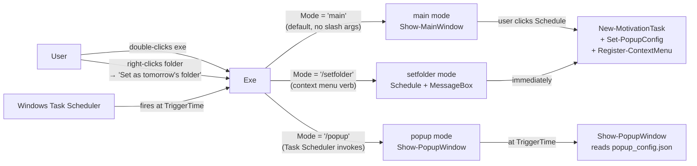
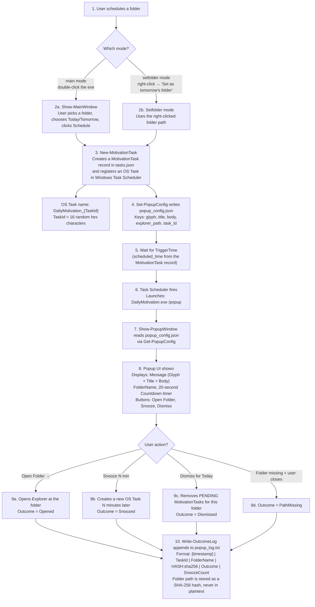
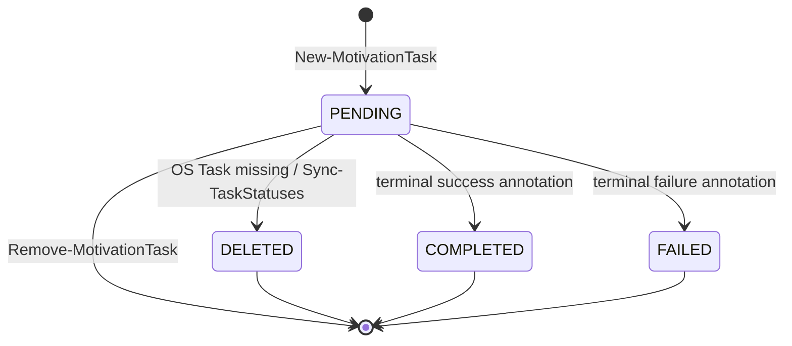
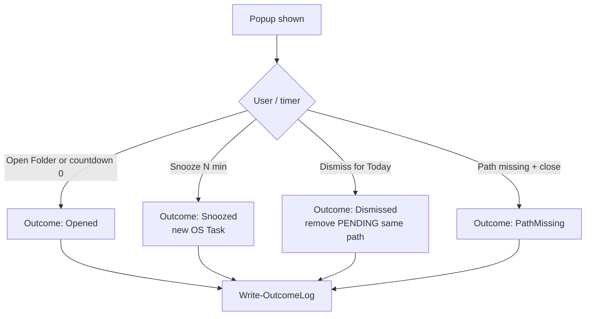

# Architecture overview

## One file, one exe

```text
DailyMotivation.ps1  →  Invoke-ps2exe -STA -noConsole  →  DailyMotivation.exe
```

There is no `src/` tree and no companion runtime files. All UI (WPF XAML), scheduling, config, and messages live in `DailyMotivation.ps1`.

| Concern           | Choice                                          |
| ----------------- | ----------------------------------------------- |
| Source runtime    | PowerShell 7 (`pwsh`) for development/tests     |
| Shipped runtime   | .NET Framework 4.x exe (ps2exe)                 |
| UI                | WPF (`-STA`); WinForms fallback for some errors |
| Scheduling        | Windows Task Scheduler                          |
| Persistence       | `%APPDATA%\DailyMotivationBrainHelper\`         |
| Shell integration | HKCU context menu (no admin)                    |

## Execution modes



| Invocation                                 | Mode value       | Entry                              |
| ------------------------------------------ | ---------------- | ---------------------------------- |
| `DailyMotivation.exe`                      | `main` (default) | `Show-MainWindow`                  |
| `DailyMotivation.exe /popup`               | `"/popup"`       | `Show-PopupWindow`                 |
| `DailyMotivation.exe /setfolder "C:\path"` | `"/setfolder"`   | Schedule for tomorrow + MessageBox |

ps2exe passes CLI arguments **with the leading slash**, so switch cases match `"/popup"` and `"/setfolder"`, not bare `popup`.

## Handoff and data flow



**Legend — what each label means:**

| Label | Plain-English meaning | Source verification |
|---|---|---|
| **main mode** | The default execution path. Entered when the user double-clicks `DailyMotivation.exe`. Shows the main window with a folder picker and schedule UI. `$Mode` is `"main"` (the default parameter value). | `CONTEXT.md` "main mode" entry; `DailyMotivation.ps1` line 3054 (`default` case in the switch) |
| **setfolder mode** | Entered when the user right-clicks a folder in Explorer and chooses "Set as tomorrow's folder". `$Mode` equals `"/setfolder"`. Creates a task for tomorrow at the default trigger hour, writes the popup config, shows a confirmation MessageBox, then exits. | `CONTEXT.md` "setfolder mode" entry; `DailyMotivation.ps1` line 3033 |
| **Show-MainWindow** | The function that renders the main WPF window. It is the entry point for main mode. | `DailyMotivation.ps1` line 1709 |
| **Show-PopupWindow** | The function that renders the popup WPF window. It is the entry point for popup mode. | `DailyMotivation.ps1` line 2391 |
| **New-MotivationTask** | Creates a `MotivationTask` record (with `task_id`, `folder_path`, `scheduled_time`, `status = "PENDING"`) and writes it to `tasks.json`. Also registers a Windows Task Scheduler entry named `DailyMotivation_{TaskId}` whose action runs `DailyMotivation.exe /popup`. | `DailyMotivation.ps1` line 608; `CONTEXT.md` "MotivationTask" entry |
| **DailyMotivation_{TaskId}** | The Windows Task Scheduler task name. `TaskId` is a 16-character random hex string generated by `[Guid]::NewGuid().ToString("N").Substring(0, 16)`. | `DailyMotivation.ps1` lines 720, 819; `CONTEXT.md` "TaskId" entry |
| **TaskId** | A 16-character random hex string that uniquely identifies a MotivationTask. Used as the key for Task Scheduler's task name and for Outcome Log entries. | `CONTEXT.md` "TaskId" entry |
| **TriggerTime** | The ISO 8601 datetime (`scheduled_time` field) at which Task Scheduler fires the popup. Set to tomorrow at the configured trigger hour (default 2:00 PM) when scheduling. | `CONTEXT.md` "TriggerTime" entry |
| **Set-PopupConfig** | Writes the `popup_config.json` file. Accepts parameters: `Glyph`, `Title`, `Body`, `ExplorerPath`, `FolderName`, `TaskId`. Also writes compatibility aliases (`folder_path`, `message_glyph`, `message_title`, `message_body`). Uses a named mutex (`Global\DailyMotivationPopupConfigLock`) to serialize writes. | `DailyMotivation.ps1` line 375; `CONTEXT.md` "PopupConfig" entry |
| **popup_config.json** | The JSON handoff file. The sole data channel between scheduling modes and popup mode. Written at schedule time, read at trigger time. Keys: `glyph`, `title`, `body`, `explorer_path`, `folder_name`, `task_id`. | `CONTEXT.md` "PopupConfig" entry; `DailyMotivation.ps1` line 173 |
| **Get-PopupConfig** | Reads `popup_config.json` and returns the config object. Returns a default object (all empty strings, glyph `"[+]"`) if the file is missing or invalid. | `DailyMotivation.ps1` line 336 |
| **explorer_path** | The JSON key for the folder path in `popup_config.json`. This is the fully-qualified folder path. Note: reading `$config.FolderPath` or `$config.folder_path` returns `$null` — the correct key is `explorer_path`. | `CONTEXT.md` "PopupConfig" entry; `DailyMotivation.ps1` line 401 |
| **Message** | A motivational content unit with three fields: `Glyph` (a 3-char bracket icon like `[+]`), `Title`, and `Body`. Selected randomly from the Messages array at schedule time and frozen in the PopupConfig. | `CONTEXT.md` "Message" entry |
| **Countdown** | A 20-second auto-open timer shown in the Popup. When it reaches zero, the app behaves as if the user clicked "Open Folder". | `CONTEXT.md` "Countdown" entry |
| **Open Folder →** | The primary popup action. The button is labeled `LetsGoBtn` in the XAML. Opens Explorer at the folder path, writes `Opened` to the Outcome Log, and closes the Popup. | `CONTEXT.md` "Open Folder" entry |
| **Snooze** | Defers the popup by N minutes (5, 15, 30, or 60). Increments the popup-session `SnoozeCount`. Creates a new OS Task; the current popup closes. | `CONTEXT.md` "Snooze" entry |
| **Dismiss for Today** | Removes all PENDING MotivationTasks whose FolderPath matches the current popup's folder. Writes `Dismissed` to the Outcome Log and closes the Popup without opening Explorer. | `CONTEXT.md` "Dismiss" entry |
| **PathMissing** | The state when the folder path stored in `popup_config.json` no longer exists on disk at the time the popup appears. Shows the path-missing panel instead of normal popup content. | `CONTEXT.md` "Path Missing" entry |
| **Outcome** | What the user did when the popup appeared. One of: `Opened`, `Snoozed`, `Dismissed`, or `PathMissing`. Written pipe-delimited to the Outcome Log. | `CONTEXT.md` "Outcome" entry |
| **Write-OutcomeLog** | Appends a pipe-delimited record to `popup_log.txt` in the AppData directory. Format: `[timestamp] | TaskId | FolderName | HASH:{sha256} | Outcome | SnoozeCount`. The folder path is hashed with SHA-256 and stored as `HASH:{hex}` (or `HASH:NO_PATH` when empty). The log file rotates when it exceeds 1MB (archives older than 30 days are deleted). | `DailyMotivation.ps1` line 423; `CONTEXT.md` "Outcome Log" entry |
| **HASH:sha256** | The SHA-256 hex digest of the folder path, prefixed with `HASH:`. The folder path is never stored in plaintext in the outcome log. | `DailyMotivation.ps1` lines 435-441; `CONTEXT.md` "Outcome Log" entry |
| **SnoozeCount** | A popup-session counter tracked in `$script:snoozeCount` and written to the Outcome Log entry. Counts how many times the user snoozed during a single popup session. Note: the `snooze_count` field on the persisted MotivationTask record is always `0` — it is initialized at creation and never updated. | `CONTEXT.md` "SnoozeCount" entry |
| **popup_log.txt** | The outcome history file in `%APPDATA%\DailyMotivationBrainHelper\`. Append-only, pipe-delimited, with rotation when the file exceeds 1MB (archives older than 30 days are deleted). | `CONTEXT.md` "Outcome Log" entry; `DailyMotivation.ps1` line 175 |

Persistent state (all under AppData):

| File                | Role                                                         |
| ------------------- | ------------------------------------------------------------ |
| `config.json`       | AppConfig (`default_trigger_hour`, `task_warning_threshold`) |
| `popup_config.json` | Handoff from schedule → popup                                |
| `tasks.json`        | MotivationTask list                                          |
| `popup_log.txt`     | Outcome history (hashed paths)                               |

## MotivationTask lifecycle



Duplicate detection only considers tasks with `status = PENDING` for the same folder path and calendar date (unless `-Force`).

## Popup outcomes



## Platform adapter

Production uses Windows APIs directly when `$script:Platform` is `$null`. Tests may inject a HeadlessPlatform object so scheduling/dialog behavior can be mocked on non-Windows runners. See [adr-003-platform-adapter.md](adr-003-platform-adapter.md).

## Related

- [CLI reference](../reference/cli.md)
- [Config reference](../reference/config.md)
- [Security overview](../security/overview.md)
