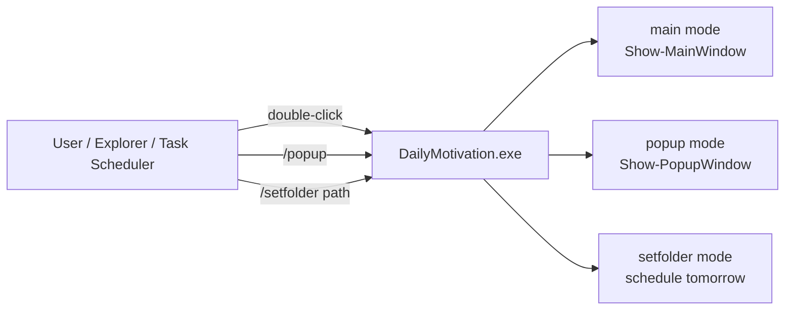
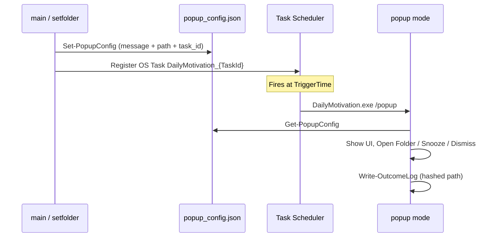
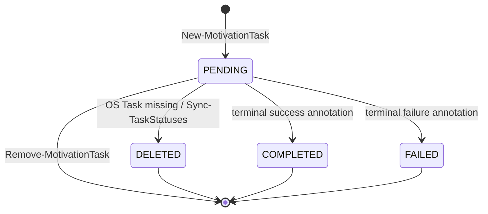
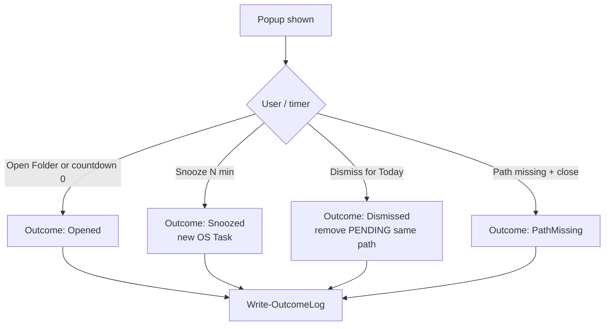

# Architecture overview

## One file, one exe

```text
DailyMotivation.ps1  →  Invoke-ps2exe -STA -noConsole  →  DailyMotivation.exe
```

There is no `src/` tree and no companion runtime files. All UI (WPF XAML), scheduling, config, and messages live in `DailyMotivation.ps1`.

| Concern | Choice |
|---------|--------|
| Source runtime | PowerShell 7 (`pwsh`) for development/tests |
| Shipped runtime | .NET Framework 4.x exe (ps2exe) |
| UI | WPF (`-STA`); WinForms fallback for some errors |
| Scheduling | Windows Task Scheduler |
| Persistence | `%APPDATA%\DailyMotivationBrainHelper\` |
| Shell integration | HKCU context menu (no admin) |

## Execution modes



| Invocation | Mode value | Entry |
|------------|------------|--------|
| `DailyMotivation.exe` | `main` (default) | `Show-MainWindow` |
| `DailyMotivation.exe /popup` | `"/popup"` | `Show-PopupWindow` |
| `DailyMotivation.exe /setfolder "C:\path"` | `"/setfolder"` | Schedule for tomorrow + MessageBox |

ps2exe passes CLI arguments **with the leading slash**, so switch cases match `"/popup"` and `"/setfolder"`, not bare `popup`.

## Handoff and data flow



Persistent state (all under AppData):

| File | Role |
|------|------|
| `config.json` | AppConfig (`default_trigger_hour`, `task_warning_threshold`) |
| `popup_config.json` | Handoff from schedule → popup |
| `tasks.json` | MotivationTask list |
| `popup_log.txt` | Outcome history (hashed paths) |

## MotivationTask lifecycle



Duplicate detection only considers tasks with `status = PENDING` for the same folder path and calendar date (unless `-Force`).

## Popup outcomes



## Platform adapter

Production uses Windows APIs directly when `$script:Platform` is `$null`. Tests may inject a HeadlessPlatform object so scheduling/dialog behavior can be mocked on non-Windows runners. See [adr-003-platform-adapter.md](adr-003-platform-adapter.md).

## Related

- [CLI reference](../reference/cli.md)
- [Config reference](../reference/config.md)
- [Security overview](../security/overview.md)
